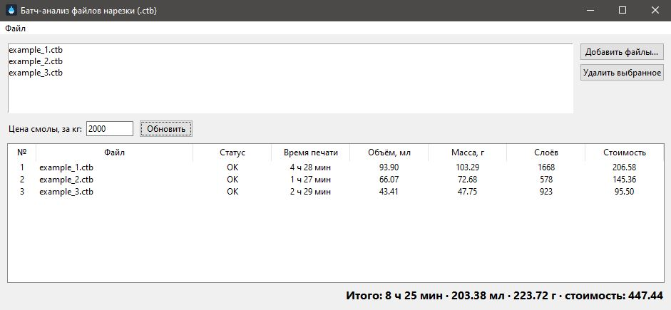

# Батч-анализ файлов нарезки (.ctb)

Windows-утилита: принимает список нарезанных файлов (`.ctb`), парсит из
каждого время печати, объём и массу смолы, показывает сводную таблицу и
итоги (в т.ч. стоимость по заданной цене смолы за кг), умеет сохранять и
открывать проект, экспортировать результат в CSV.

Архитектура: C++ библиотека-парсер (DLL, плоский C API) + Python/tkinter
GUI, вызывающий DLL через `ctypes`.



Как устроен сам формат `.ctb` и что про него выяснено —
[`docs/format_notes.md`](docs/format_notes.md).

Поддерживаемый на сегодня вариант формата — **CTBv4 с зашифрованным
служебным заголовком** (magic `0x12FD0107`; такой создают, например, новые
версии Chitubox и принтеры вроде Elegoo Mars 3).

## Сборка и запуск под Linux (разработка/тесты)

Годится для правки логики парсера и GUI и прогона тестов — не даёт
Windows-`.exe`.

```sh
# C++ core + юнит-тесты (GoogleTest подтягивается через FetchContent)
cmake -S . -B build
cmake --build build -j
./build/bin/slicer_parser_tests

# Python: биндинги + модель + GUI
python3 -m venv .venv && source .venv/bin/activate
pip install -r python/requirements.txt
python3 -m pytest python/tests/
python3 python/gui/app.py
```

## Сборка под Windows (целевая платформа)

### Вариант 1 — кросс-компиляция из WSL2

Не требует переключения в PowerShell/cmd и Visual Studio Build Tools —
достаточно MinGW-w64 (`x86_64-w64-mingw32-gcc`/`g++`), установленного внутри
WSL2. Собранный кросс-компилятором `.exe` можно сразу запускать прямо из
WSL bash — WSL передаёт такой процесс настоящему ядру Windows (interop),
Wine не нужен.

1. **C++ core (DLL + тесты)**:

   ```sh
   cmake -S . -B build -DCMAKE_TOOLCHAIN_FILE=cmake/mingw-w64-x86_64.toolchain.cmake
   cmake --build build -j
   ./build/bin/slicer_parser_tests.exe
   ```

   Результат — `build/bin/slicer_parser.dll` и
   `build/bin/slicer_parser_tests.exe`, оба без внешних рантайм-DLL
   (статически слинкованы libgcc/libstdc++/libwinpthread). Тесты гоняются
   на файлах из `examples/` через настоящий Windows-процесс — если
   что-то не так с окружением, это будет видно сразу (проверено: 8/8
   тестов зелёные).

   Если до этого `build/` уже был сконфигурирован под Linux (`.so`) —
   тулчейн в существующем кэше не подменить, сначала `rm -rf build`.

2. **Python-окружение и упаковка** — те же шаги и команды, что в
   Варианте 2 (пп. 2-3): DLL из этой сборки `parser_bindings.py` и
   `pyinstaller.spec` находят по тому же пути `build/bin/`, без правок.
   Учтите только, что PyInstaller **не кросс-компилирует** — сам
   `pyinstaller` всё равно нужно запускать под настоящим
   Windows-интерпретатором Python (не под Python из WSL), даже если DLL
   внутри собрана в WSL.

### Вариант 2 — нативная сборка на Windows (MSVC)

Если WSL или MinGW недоступны: из PowerShell/cmd с установленными Visual
Studio Build Tools (или полной Visual Studio) с компонентом "Desktop
development with C++".

1. **C++ core (DLL)**:

   ```powershell
   cmake -S . -B build -A x64
   cmake --build build --config Release
   ```

   Результат — `build\bin\Release\slicer_parser.dll` и
   `build\bin\Release\slicer_parser_tests.exe`. Прогоните тесты
   (`.\build\bin\Release\slicer_parser_tests.exe`) — все они гоняются на
   файлах из `examples/`, если что-то не так с окружением, это будет видно
   сразу.

2. **Python-окружение**:

   ```powershell
   py -m venv .venv
   .venv\Scripts\activate
   pip install -r python\requirements.txt
   python -m pytest python\tests\
   python python\gui\app.py   # ручная проверка GUI
   ```

3. **Упаковка в портативный `.exe`** (PyInstaller подхватит DLL из
   `build\bin\Release\` или `build\bin\` — см. `python/packaging/pyinstaller.spec`):

   ```powershell
   cd python
   pyinstaller packaging\pyinstaller.spec
   ```

   Готовый файл — `python\dist\chitubox_batch_analyzer.exe`.

## Структура проекта

```
ctb-batch-analyzer/
├── README.md                      # этот файл
├── Chitubox_batch_analyzer.exe    # собранный exe-файл для запуска на Windows
├── CMakeLists.txt                 # корневой, add_subdirectory(core)
├── .clang-format
├── .gitignore
│
├── cmake/
│   └── mingw-w64-x86_64.toolchain.cmake  # кросс-сборка Windows-DLL из WSL2
│
├── examples/                      # эталонные .cbddlp/.ctb файлы для тестов
│   └── example_*.ctb
│
├── screenshots/                   # скриншоты GUI для README
│   └── screenshot.JPG
│
├── core/                          # C++ парсер (DLL)
│   ├── CMakeLists.txt
│   ├── include/
│   │   └── slicer_parser/
│   │       ├── slicer_parser.h    # публичный C API (extern "C")
│   │       └── slice_stats.h      # layout SliceStats, общий с ctypes
│   ├── src/
│   │   ├── slicer_parser.cpp      # диспетчер по magic (сейчас — 1 вариант)
│   │   ├── ctb_format.h/.cpp      # структуры и парсинг CTBv4 encrypted
│   │   ├── aes256_cbc.h/.cpp      # обёртка над вендоренной tiny-AES-c
│   │   └── third_party/tiny_aes/  # kokke/tiny-AES-c (Unlicense), не трогаем
│   └── tests/
│       ├── CMakeLists.txt         # FetchContent(GoogleTest)
│       └── test_parse_file.cpp    # эталонные значения из examples/
│
├── python/                        # GUI + биндинги
│   ├── requirements.txt
│   ├── parser_bindings.py         # ctypes-обёртка над DLL
│   ├── gui/
│   │   ├── __init__.py
│   │   ├── app.py                 # точка входа
│   │   ├── model.py               # логика без tkinter (список файлов, итоги)
│   │   ├── project_io.py          # сохранение/открытие проекта (JSON), без tkinter
│   │   ├── main_window.py
│   │   ├── assets/
│   │   │   ├── app_icon.png       # значок окна/панели задач (root.iconphoto)
│   │   │   └── app_icon.ico       # значок .exe (иконка в Проводнике/на ярлыке)
│   │   └── widgets/
│   │       ├── file_list.py
│   │       └── results_table.py
│   ├── tests/
│   │   ├── test_parser_bindings.py   # сверка с теми же examples/
│   │   ├── test_model.py             # пересчёт итогов/стоимости
│   │   └── test_project_io.py        # round-trip сохранения/открытия проекта
│   └── packaging/
│       └── pyinstaller.spec
│
└── docs/
    └── format_notes.md            # реверс-инжиниринг офсетов, версии заголовка,
                                   # что проверено/не проверено (живой документ)
```

Почему так:

- `core/` и `python/` — равноправные соседи верхнего уровня, а не
  `src/core` + `src/python`: это два разных языка и тулчейна (CMake и
  venv/pip), общий `src/` над ними ничего не даёт.
- `cmake/` — отдельно от `core/`, потому что тулчейн-файл для
  кросс-компиляции не относится к конкретной библиотеке, а настраивает
  сам CMake ещё до всех `add_subdirectory` (см. раздел «Сборка под
  Windows» выше).
- `examples/` — единственный источник эталонных файлов сразу для C++- и
  Python-тестов, без дублирования.
- `core/include/slicer_parser/` отделён от `core/src/`: в `include/` — только
  то, что видит внешний потребитель DLL (в том числе Python/ctypes), в
  `src/` — внутренняя реализация.
- `docs/format_notes.md` — живой документ реверс-инжиниринга формата
  (офсеты, версии заголовка, какие профили Chitubox подтверждены),
  отдельно от остальной документации, чтобы конкретные технические факты
  не смешивались с общим описанием проекта.

## Код-стайл и конвенции

### C++

- Стандарт C++17. Стиль — Google C++ Style Guide как база, форматирование —
  через `.clang-format` в корне репозитория; прогонять `clang-format` перед
  коммитом.
- Именование: `PascalCase` для структур/типов (`MainHeader`,
  `PrintParameters`, `SliceStats`), `snake_case` для функций и переменных
  (`parse_file`, `print_time_s`).
- Бинарные структуры (заголовки файлов формата):
  - только типы фиксированной ширины (`uint32_t`, `int32_t` и т.п.), никогда
    `int`/`long`;
  - `#pragma pack(push, 1)` / `#pragma pack(pop)` вокруг структуры;
  - сразу под структурой — `static_assert(sizeof(MainHeader) == N, "...")`.
    Это единственная защита от того, что компилятор молча добавит padding и
    все офсеты «поплывут» — обязательный пункт, не опция.
- Граница C API (`extern "C"`): только POD-структуры и коды возврата.
  Исключения не должны пересекать границу DLL — оборачивать тело функции в
  `try/catch` и возвращать код ошибки.
- Тесты: GoogleTest, подключается в `core/tests/CMakeLists.txt` через
  `FetchContent`. Эталонные значения — из файлов в `examples/`.

### Python

- PEP 8, типхинты везде, включая `parser_bindings.py` — там типы
  документируют бинарный контракт с C++.
- `SliceStats` на Python-стороне — `ctypes.Structure` с `_pack_ = 1`,
  побайтово зеркалирующая C++-структуру. Рядом — `@dataclass`-обёртка с
  «человеческими» типами (например, `datetime.timedelta` вместо секунд);
  `ctypes.Structure` напрямую в GUI-код не передавать.
- `gui/` не работает с ctypes напрямую — только через `parser_bindings.py`.
  Внутри `gui/`: логика пересчёта (сумма времени/объёма/массы, стоимость)
  отделена от tkinter-виджетов, чтобы её можно было unit-тестировать без
  поднятия окна.
- `pathlib.Path` вместо `os.path`; `logging` вместо `print` для диагностики
  ошибок парсинга.
- Тексты в интерфейсе (кнопки, заголовки колонок, статусы) — на русском,
  проект для личного использования на русском языке.
